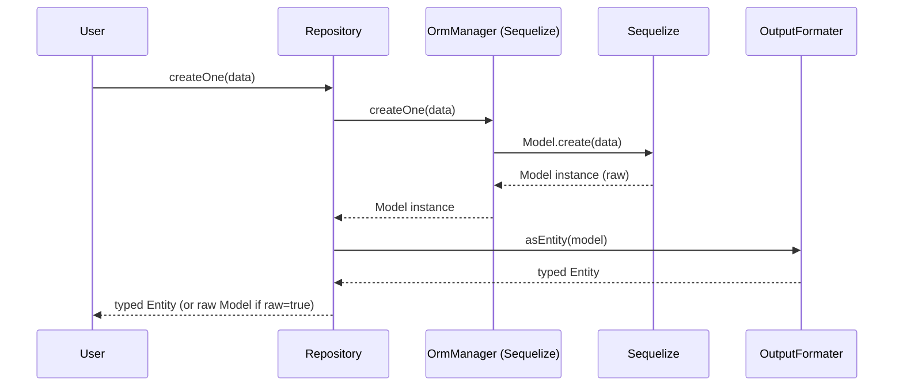
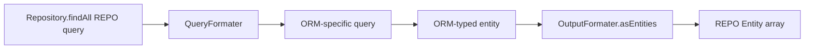

# node_repo

**Status: in development.**

A polymorphic, type-safe ORM abstraction for TypeScript. One
`Repository<T>` works across [Sequelize](https://sequelize.org/) today and
[Prisma](https://www.prisma.io/) tomorrow — the application code stays the
same.

The layer turns ORM-specific typed entities into fully typed domain entities
defined by your `EntityBase` shape. Your type definition of an `Entity` is
independent of the ORM layer definition. When you decide to switch ORM —
e.g., from Sequelize to Prisma — all you need to do is uninstall Sequelize and
install the Prisma package. The application requires the following
configuration:

- A definition for your entities (see `tests/testSkeleton/entities.ts`).
- An `EntityConfig` definition for each entity (this will auto-generate
  definitions for the Sequelize model or Prisma schema, plus an
  `EntityMetadata`). This feature is not fully implemented yet. Currently
  it looks like this:
  1. Define `EntityConfig<YourEntity>` → `new EntityMetadataManager(EntityConfig<YourEntity>, relations)` → `EntityMetadata` (see `tests/testSkeleton/config.ts`).
  2. Define the Sequelize models manually (see `tests/testSkeleton/models.ts`).

To initialize your repository, follow these steps:

1. Import the repository from `src/repository/repository.ts`.
2. Import your ORM connection (currently only Sequelize connections are
   accepted).
3. Initialize the repository:
   `await Repository.init(connection, metadata, ormEntity)`
   where `ormEntity` is either a Sequelize `Model` or a Prisma model.

The application currently handles the following ORM conversion with the
specified dialects:

- Sequelize
  - mysql
  - sqlite

## Why this exists

First of all, I wanted to learn something new, so I chose a project of this
kind: **CREATE A MINI ORM LAYER THAT WILL HANDLE USAGE OF MULTIPLE ORM
LAYERS**.

## Current stage of development

My current goal is to implement:

- A full `QueryFormater` class that turns domain-level queries into
  ORM-level queries. The top layer has its own query language that should
  stay independent of any ORM-specific query language.
- Implementations for all available Sequelize dialects.

## What has been solved so far

These solutions are specific to vanilla Sequelize:

1. **Model instantiation cost** — every row creates a `Model` proxy with
   getter / setter / validator / hook chains. At 1000+ rows this is
   significant overhead. Bypassing it with `raw: true, nest: true` returns
   plain objects, but you then lose typed entities and joined-row
   deduplication. This layer operates on the plain-object path and adds the
   typing and deduplication on top. (The solution applies only when
   retrieving multiple entities.)
2. **Polymorphism lock-in** — Sequelize is hard to swap. Application code
   learns `Model.findAll`, `include`, `where`, and Sequelize-specific
   operators. Switching to Prisma means rewriting call sites. With a
   polymorphic `Repository<T>`, the call sites stay identical.
3. **Type-level drift** — when a column type changes, the model, the
   formatters, and the runtime converters drift apart silently. The
   `EntityTransformRules` machinery derives the runtime converter types
   from the dialect build, so the compiler keeps the type definitions and
   runtime behavior in sync.

## Architecture

Four layers, dependencies flow downward:

```
┌─────────────────────────────────────────────────┐
│ Repository         (src/repository/)            │  ← user-facing entry point
├─────────────────────────────────────────────────┤
│ QueryFormaterBase  (src/formaters/query/)       │  ← query DSL (reserved)
├─────────────────────────────────────────────────┤
│ OrmMenagerBase     (src/ormManager/)            │  ← CRUD contract
├─────────────────────────────────────────────────┤
│ Sequelize / Prisma       (src/layers/)          │  ← raw DB layer
├─────────────────────────────────────────────────┤
│ OutputFormaterBase (src/formaters/output/)      │  ← row → entity conversion
└─────────────────────────────────────────────────┘
```

- **Repository** — what application code calls. Wires the other layers
  via dynamic imports so the ORM-specific code is not bundled until
  needed.
  **QueryFormaterBase** — reserved for the future declarative query
  implementation (`findOne`, `findAll`, aggregate queries). The slot
  exists so the public API can stay stable while the implementation
  lands.
- **OrmManagerBase** — abstract CRUD surface (`createOne`,
  `deleteOne`, `destroyAll`). Subclassed per ORM.
- **OutputFormaterBase** — converts ORM rows into typed entities via
  dialect-aware converters.

## Data flow

### `createOne` path (current)



### Future query path (`findAll`, etc.)

The reserved `QueryFormaterBase` will plug in here:



## Highlights

- **Polymorphic `Repository<T>`** — one class, any ORM. Dynamic import
  by ORM name picks the right `OrmManager` and `OutputFormater`
  implementations; the public API stays identical.
- **Type-level query DSL** — `Query<E>`, ordering templates
  (`` `by ${attribute} asc nulls first` ``), aggregate functions
  (`$count`, `$sum`, `$avg`, `$min`, `$max`), range filters
  (`_from`/`_to`), `exclude`-mode selection — all checked at compile
  time against your entity shape.
- **Dialect-aware converters** — per-dialect (MySQL, SQLite)
  attribute and aggregate converters. The dialect build object drives
  `EntityTransformRules`, so the compiler keeps type definitions and
  runtime converters in sync.
- **Recursive relation handling** — 1:1, 1:N, N:1, N:M, including
  arbitrarily nested sub-entities. Relation trees use lazy callbacks
  (`getSubEntities: () => ...`) so cyclic graphs don't cause infinite
  recursion.

## Requirements

- Node.js 20+ (uses native `--env-file` and `node --test`).
- TypeScript 5.7+.

## Install

```bash
npm install
```

## Scripts

| Command             | Purpose                                                          |
| ------------------- | ---------------------------------------------------------------- |
| `npm start`         | Bootstraps the application entry point (`index.js`).             |
| `npm test`          | Runs the full test suite via `node --test` with `tsx` on SQLite. |
| `npm run docs`      | Generates the TypeDoc API reference into `docs/api/`.            |
| `npm run docs:watch`| Regenerates docs on save.                                        |

## Configuration

Environment files live in `config/`:

- `config/.env`                  — default development settings.
- `config/.env.sequelize_mysql`  — test profile for MySQL.
- `config/.env.sequelize_sqlite` — test profile for SQLite (used by
  `npm test`).

`npm test` already passes `--env-file=config/.env.sequelize_sqlite`.

## Project layout

```
src/
  types/entity/                  Type-level DSL
    Root.ts                      EntityBase, ExternalReferences, ...
    Query.ts                     Query<E>, QuerySelect, OrderOptions, ...
    Metadata.ts                  EntityMetadata, SortOptions, ...
    Converters.ts                TransformRule, EntityTransform, ...
    Creation.ts                  CreationOptional, EntityCreationAttributes
  formaters/
    output/                      Row → entity conversion
      outputFormaterBase.ts      Abstract formater
      buildConverters.ts         Type-keyed → attribute-keyed converters
      convertRow.ts              Single-row transformation (recursive)
      mapSelects.ts              QuerySelect → MapEntitySelect
    query/                       Query DSL (reserved)
      queryFormaterBase.ts       Abstract query formater (future)
  layers/sequelize/              Sequelize implementation
    dialects/{mysql,sqlite}/     Per-dialect converter build + functions
    manager/ormManager.ts        Concrete OrmManager
    output/
      formater.ts                Concrete OutputFormater
      mergeRowsIntoEntities.ts   raw:true, nest:true deduplication
  metadata/entityMetadataMenager.ts  Attribute lists, lazy order/group trees
  ormManager/ormMenagerBase.ts   Abstract CRUD contract
  repository/repository.ts       Polymorphic entry point (Repository.init)
  tree/treeBuilders.ts           Cycle-safe relation-tree builder
tests/
  testSkeleton/                  Shared entities, models, repos, seed data
  formaters/output/              buildConverters, convertRow, mapSelects tests
  layers/sequelize/output/       mergeRowsIntoEntities, compareOutput tests
  layers/sequelize/repository/   Manager CRUD lifecycle tests
config/                          Connection bootstrap, env files, test setup
docs/api/                        Generated TypeDoc reference (npm run docs)
```

## Usage — `Repository<T>` (recommended)

```ts
import { Repository } from 'src/repository/repository'
import { productMetadata, Product, ProductModel } from 'tests/testSkeleton/config'
import connection from 'config/connection'

const repo = await Repository.init<Product, ProductModel>(
    connection,
    productMetadata,
    ProductModel
)

const created = await repo.createOne({ brand: 'Samsung', model: 'Galaxy S23' })
//    => Product  (typed entity)

const rawRow  = await repo.createOne({ brand: 'Apple', model: 'iPhone 15' }, true)
//    => ProductModel  (raw Sequelize instance)

await repo.destroyAll()
```

`createOne` returns a typed entity by default. Pass `true` as the
second argument to receive the raw ORM model instead.

## Usage — `OutputFormater` (advanced)

If you want to convert raw `raw: true, nest: true` rows yourself, use
the formater directly:

```ts
import { OutputFormater } from 'src/layers/sequelize/output/formater'
import { createRelationTree } from 'src/tree/treeBuilders'
import { productMetadata, Product, ProductModel } from 'tests/testSkeleton/config'

const tree     = createRelationTree(productMetadata)
const formater = new OutputFormater<Product, ProductModel>(productMetadata, tree, 'mysql')

const query: Query<Product> = {
    active: true,
    prices:             { select: ['id', 'price'] },
    specification_tree: { select: ['id', 'specification_type'] },
}

const entity   = formater.asEntity(row, query)
const entities = formater.asEntities(rows, query)
```

## Type-level features

- `EntityQueryable<E>` / `Query<E>` — typed filtering with `_from` /
  `_to` ranges for `Date` and numeric fields
  (`EntityQueryExtendedAttributes`).
- `QuerySelect<E>` — select arrays, `{ exclude: [...] }` objects, or
  mixed with aggregate functions (`$count`, `$sum`, `$avg`, `$min`,
  `$max`).
- `OrderOptions<E>` — template-literal ordering strings like
  `` `by ${attribute} asc nulls first` `` with aggregate suffixes.
- `EntityTransform<E, R>` — applies transform rules to base
  attributes, nested entities, and aggregate results via one
  composable type.
- `TransformRule<O, T>` / `MatchedType<T, R>` / `TransformType<T, R>` —
  the derivation pipeline that keeps type definitions in sync with
  runtime converters.

## Testing

```bash
npm test
```

The suite uses the built-in `node --test` runner. Coverage includes:

- `compareOutput.test.ts` — deep equality between formater output and
  raw Sequelize output (`toJSON()` and `raw: true, nest: true`),
  across simple queries, one-level relations (1:1, 1:N, N:1),
  two-level nested relations in every combination, and mixed / deeply
  nested includes.
- `manager.test.ts` — Sequelize `Repository` CRUD lifecycle
  (`createOne`, `destroyAll`) against the `testSkeleton` fixtures.
- Formater unit tests (`buildConverters`, `convertRow`,
  `mapSelects`) and merge-row unit tests (`mergeRowsIntoEntities`,
  `rowIsUniqueOrNotMerged`, `entityRowIsUnique`,
  `subRowIsUniqueOrNotMerged`, `rowToGrouped`).

A known cosmetic mismatch exists between `toJSON()` Date
stringification and the native `Date` objects produced by the
formater; the affected assertions are tracked separately and excluded
from the green set.

## Documentation

- This README — entry point, architecture, usage.
- **TypeDoc API reference** — generated from TSDoc comments. Generated
  into [`docs/api/`](https://Greenpaul11.github.io/node_repo/). Run `npm run docs` to
  regenerate. Covers every public class, method, type, and parameter.

## License

MIT — see [`LICENSE`](./LICENSE).
